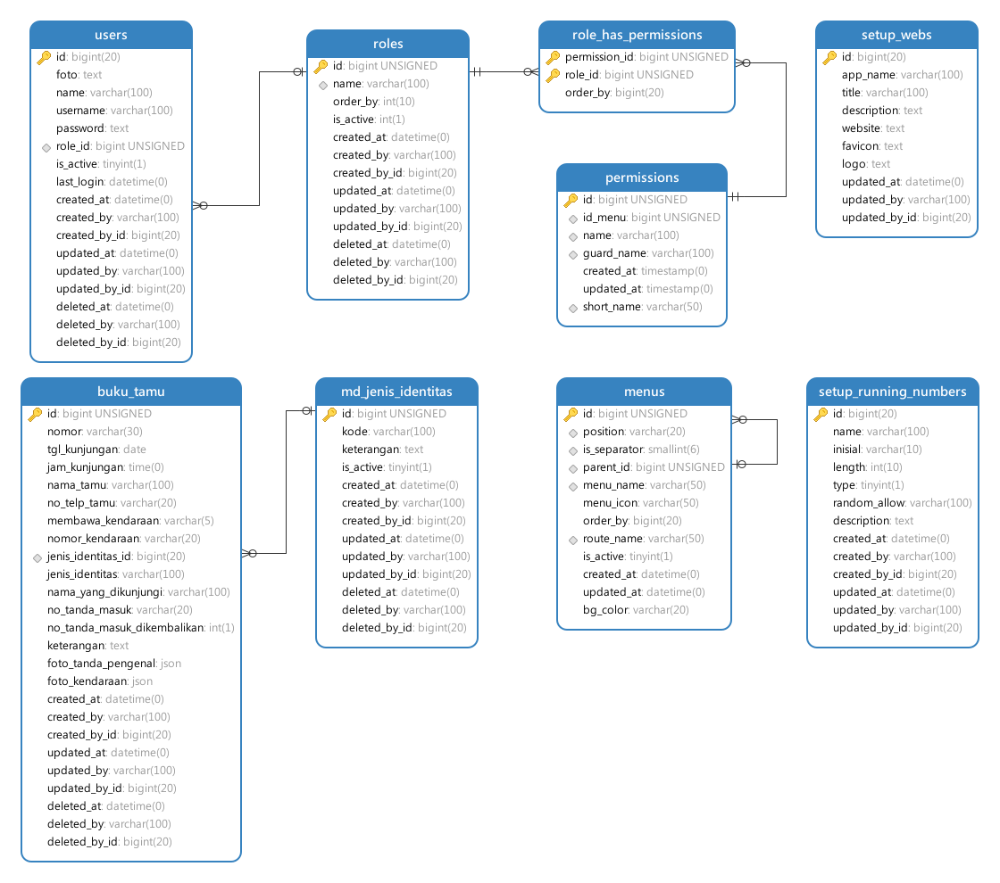
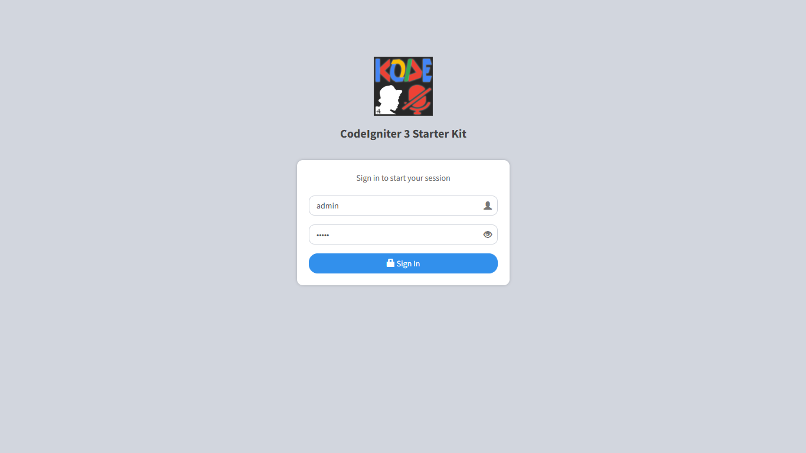
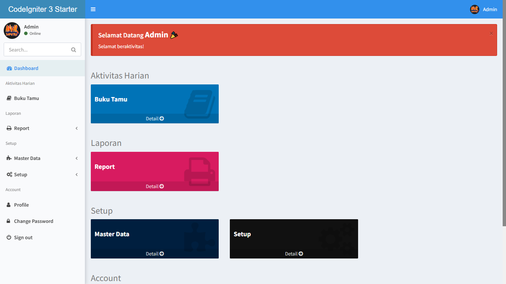
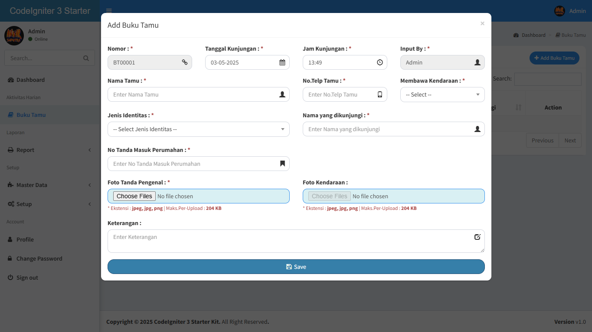
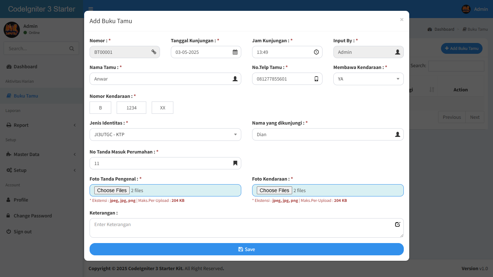
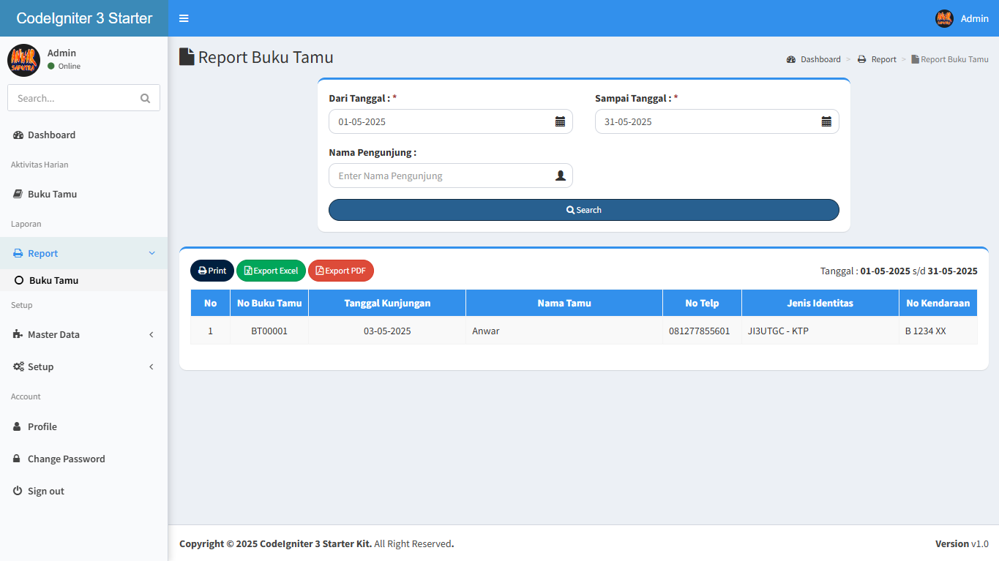
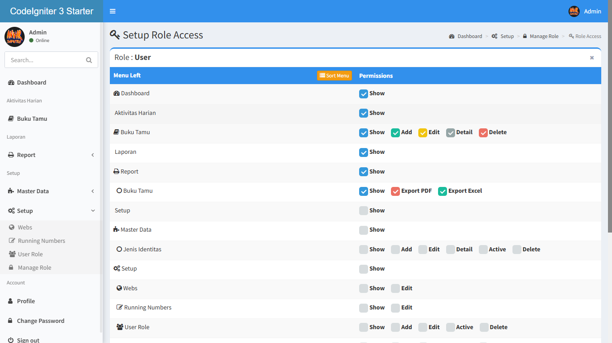
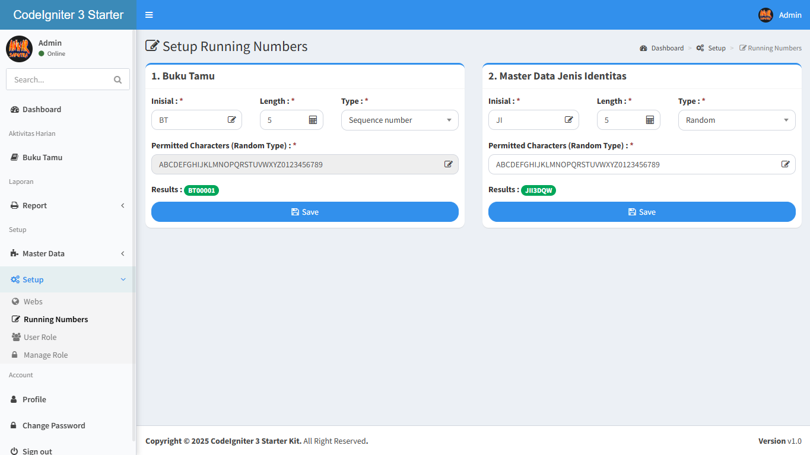

# CodeIgniter 3 Starter Kit
## 🙌 Support & Donations

**CodeIgniter 3 Starter Kit** is an open-source project aimed at helping developers kickstart PHP application development quickly, cleanly, and in a well-structured manner — all without a framework.

If you find this project helpful and would like to support its ongoing development, you can show your appreciation through a donation. Your support means a lot and helps keep the project alive and growing!

☕ Support me via: <br/>
&nbsp; 👉 [💸 PayPal](https://paypal.me/anwarsptr) <br/>
&nbsp; 👉 [💖Bank Transfer / Virtual Account](https://anwarsptr.com/profile#paymentMethod)

Thank you so much for your support! 🙏

---

## 🎯 Live Demo
Take a look at how the app works in action! <br/>
 👉 <a href="https://demo.pustakakreatif.com/github/codeigniter-3-starter-kit" target="_blank" rel="noopener noreferrer">🌐 Demo CodeIgniter 3 Starter Kit</a> <br/><br/>
 🔐 Login Account :
  - username : `admin`
  - password : `admin`

---

## 🔧 Requirements

- PHP 8.2+
- MySQL 5.7+ or MariaDB 10.6+
- Composer 2.8+


## 🛠 Tools
  - [AdminLTE Template](https://adminlte.io/themes/AdminLTE)
  - [Bootstrap v3.3.7](https://blog.getbootstrap.com/2016/07/25/bootstrap-3-3-7-released)
  - [parsleyjs](https://parsleyjs.org)
  - [DataTables v1.10.15](https://cdn.datatables.net/1.10.15)
  - Print Preview
    - [PrintThis](https://jasonday.github.io/printThis)
  - Export
    - [jsPDF](https://github.com/simonbengtsson/jsPDF-AutoTable)
    - [Exceljs](https://github.com/exceljs/exceljs)

---

## ⚡ Quick Start

1. Clone the repository:

```bash
git clone https://github.com/anwarsptr/codeigniter-3-starter-kit
cd codeigniter-3-starter-kit
```

2. Install dependencies:

```bash
composer install
npm install
```

3. Set up environment:

```bash
cp .env.example .env
```

4. Configure databases in `.env`:

```env
DB_HOST=localhost
DB_PORT=3306
DB_DATABASE=your_database
DB_USERNAME=your_username
DB_PASSWORD=your_password
```

5. Import database `database/db.sql`:
   👉 [How to Import the Database](database/README.md)

7. Run the application
    - Run with composer
      - Default Port (8080)
      ```bash
      composer serve
      ```
      - Custom Port
      ```bash
      PORT=8000 composer serve
      ```
      - Run using .bat
      ```bash
      composer serve-bat
      ```
      - Run using .py
      ```bash
      composer serve-py
      ```
    - Run it by clicking or opening
      - `run.bat`
      - `run.py`
---


## 📋 Features

  - ✅ Organized folder structure  
  - ✅ Simple routing  
  - ✅ File autoloading  
  - ✅ MySQLi database connection  
  - ✅ Role & Permission management  
  - ✅ Ajax-based CRUD operations  
  - ✅ Server-side DataTables integration  
  - ✅ Customizable numbering system (Sequential or Random)  
  - ✅ Reporting (Print Preview, Export to PDF & Excel)  
  - ✅ Ready to use and easy to extend

## 🗂️ Database Diagram

  <a href="database/Diagram.svg" target="_blank">
    
  </a>

## 📸 Screenshot
  - Login
  <a href="img/example/login.png" target="_blank">
    
  </a><br/><br/>

  - Dashboard
  <a href="img/example/dashboard.png" target="_blank">
    
  </a><br/><br/>

  - Buku Tamu
  <a href="img/example/buku-tamu-1.png" target="_blank">
    
  </a>
  <a href="img/example/buku-tamu-2.png" target="_blank">
    
  </a><br/><br/>

  - Report
  <a href="img/example/report.png" target="_blank">
    
  </a><br/><br/>

  - Setup Role & Permission Management
  <a href="img/example/role-permission-management.png" target="_blank">
    
  </a><br/><br/>

  - Setup Running Numbers
  <a href="img/example/running-numbers.png" target="_blank">
    
  </a>

---

  <br/>

## 📝 License

This project is open-sourced software licensed under the [MIT license](https://opensource.org/licenses/MIT).

## 👏 Credits

Created by [Anwar Saputra](https://anwarsptr.com) - CodeIgniter 3 Starter Kit | anwarsptr.com
